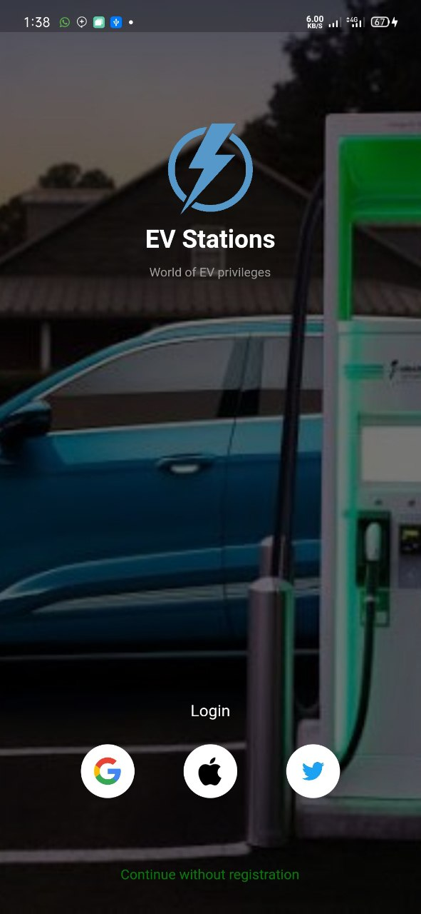
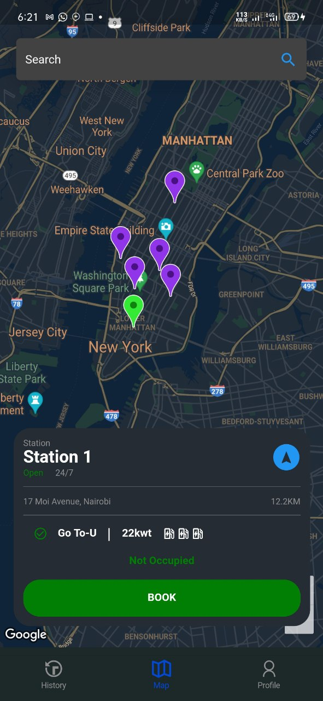
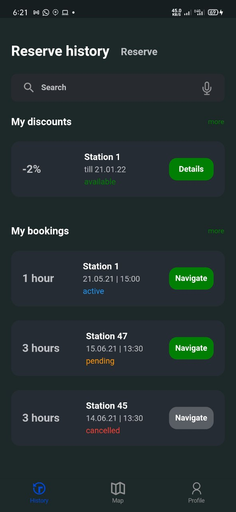

# EV Station Finder

A mobile application UI developed using Flutter to help users find electric vehicle charging stations in their vicinity.

## Description

The EV Station Finder is designed to simplify the process of locating charging stations for electric vehicles. Leveraging the power of Flutter for a seamless cross-platform experience, the application provides the following features:

- **Search Nearby Charging Stations**: Enter a location or use the device's GPS to find nearby electric vehicle charging stations.
  
- **Filter Results**: Users can filter search results based on various criteria like the type of charging point, power rating, availability status, etc.
  
- **Station Details**: Clicking on a station provides detailed information, including number of ports, operating hours, cost per kWh, and user reviews.
  
- **Navigation**: Integrated with popular map applications to provide turn-by-turn navigation to the selected charging station.

- **Favorites**: Users can save frequently visited charging stations to a favorites list for quick access in the future.

## Sample Screenshots

    
    
    

## Built With

- **Framework**: [Flutter](https://flutter.dev/)

## Getting Started

1. Clone the repository.
2. Navigate to the project directory.
3. Run `flutter pub get` to install dependencies.
4. Use `flutter run` to start the application.

## Contribution

Pull requests are welcome. For major changes, please open an issue first to discuss what you would like to change.

## License

[MIT](LICENSE)

